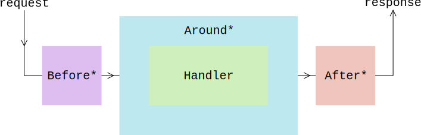

# Why use Rust for web servers?

Same reasons you'd use Rust for anything else:

* Compete with C on performance.
* Run on embedded devices.
* Expressive static type checking.
* Great package management and community.

# What is Iron?


Framework for building web apps, built atop the [Hyper][] HTTP library.

. . .

I/O is blocking. For non-blocking see [MIO][mio].


# Structure



```rust
trait AroundMiddleware {
    fn around(self, handler: Box<Handler>) -> Box<Handler>;
}
```

# What can it do?

* [Routing][].
* [Logging][].
* Database interaction ([Postgres][]).
* JSON.
* HTML templating ([Handlebars][]).
* [Persistent storage][].

# JSON

Automatically generate serialisation code!

```rust
#[derive(RustcEncodable, RustcDecodable)]
struct Process {
    pub name: String,
    pub id: i32,
    pub children: Vec<i32>
}

let handler = |_req: &mut Request| {
    let process = Process {
        name: "Hello world!".to_string(),
        id: 1,
        children: vec![2, 4, 8, 16]
    };
    let body = json::encode(&process).unwrap();
    Ok(Response::with(body))
};

Iron::new(handler).http("0.0.0.0:3000").unwrap();
```

. . .

```json
{"name":"Hello world!","id":1,"children":[2,4,8,16]}
```

# URL Query Parameters

```
GET /?name=Bland+Example&age=9000
```

. . .

```rust
use urlencoded::UrlEncodedQuery;

fn handler(req: &mut Request) -> IronResult<Response> {
    let params = match req.get_ref::<UrlEncodedQuery>() {
        Ok(p) => p,
        Err(_) => return Ok(Response::with("No query given"))
    };
    for (key, values) in params {
        println!("> {:?}: {:?}", key, values);
    }
    Ok(Response::with(format!("{:?}", params)))
}
```

. . .

How does `req.get_ref::<UrlEncodedQuery>()` work?

# Plugins

. . .

1. Pass around a cache for storing values.

. . .

2. Compute the values in the cache on demand.

. . .

The cache is a [*type map*][TypeMap].

# Type map

Map from *types* to arbitrary values. Implemented using [std::any::Any][Any] - dynamic typing in Rust!

. . .

```rust
pub trait Key: Any {
    type Value: Any;
}
```

. . .

```rust
struct UrlEncodedQuery;

type QueryMap = HashMap<String, Vec<String>>

impl Key for UrlEncodedQuery {
    type Value = QueryMap;
}
```

# Plugin traits

```rust
pub trait Plugin<E: ?Sized>: Key {
    type Error;

    fn eval(&mut E) -> Result<Self::Value, Self::Error>;
}
```

. . .

```rust
impl<'a, 'b> Plugin<Request<'a, 'b>> for UrlEncodedQuery {
    type Error = UrlDecodingError;

    fn eval(req: &mut Request) -> Result<QueryMap, UrlDecodingError> {
        match req.url.query {
            Some(ref query) => create_param_hashmap(&query),
            None => Err(UrlDecodingError::EmptyQuery)
        }
    }
}
```

. . .

See [Plugin source][] for caching logic and more details.

# Performance?

At the moment Iron achieves 23.7% the performance of the fastest implementation on TechEmpower's
[Web Framework Benchmark][].

. . .

* Naive implementation.

. . .

* Beats ExpressJS, Flask, other Iron frameworks.

. . .

* Beaten by a few Java servlet things, Haskell's WAI, LWAN (insane C thing).

# Want to help out?

* Improve performance, benchmark.
* Integrate with more databases and ORMs (like [Diesel][]).
* Integrate with more HTML templating libraries.
* Scale Iron apps accross a cluster.

# See Also

* [Brian Anderson's wonderful intro to making apps with Iron](https://github.com/brson/httptest).
* [Iron organisation on Github](https://github.com/iron).
* [My Festivus project][festivus], a time-series database backed by Postgres.

# Thanks!

[Routing]: https://github.com/iron/router
[Logging]: https://github.com/iron/logger
[Postgres]: https://github.com/martinsp/iron-postgres-middleware
[Handlebars]: https://github.com/sunng87/handlebars-iron
[Persistent storage]: https://github.com/iron/persistent
[Any]: http://doc.rust-lang.org/std/any/trait.Any.html
[TypeMap]: https://github.com/reem/rust-typemap
[Plugin source]: https://github.com/reem/rust-plugin
[Web Framework Benchmark]: https://www.techempower.com/benchmarks/#section=data-r11&hw=peak&test=json
[mio]: https://github.com/carllerche/mio
[Hyper]: https://github.com/hyperium/hyper
[Diesel]: https://github.com/sgrif/diesel
[festivus]: https://githu.com/michaelsproul/festivus
